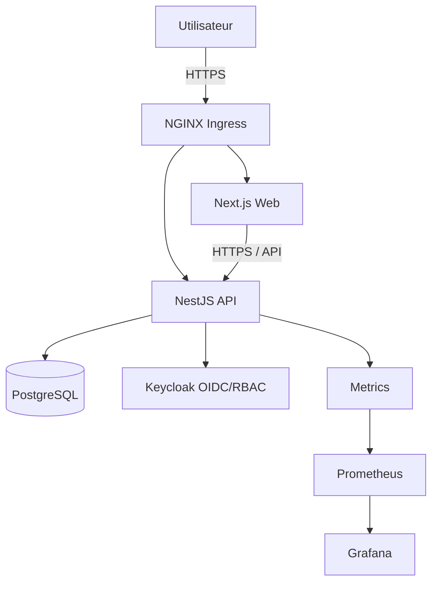
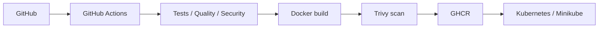

# Architecture cible

## Décision

La V1 utilise un **monolithe modulaire conteneurisé**. Une architecture microservices n'est pas retenue pour le POC car elle augmenterait fortement la complexité d'exploitation sans bénéfice démontré pour le périmètre initial.

## Vue logique

## Modules backend prévus

- Auth / Security
- Listings
- Moderation
- Health
- Observability

## Déploiement cible POC

## API initiale

- `POST /api/listings`
- `GET /api/listings`
- `GET /api/me/listings`
- `PATCH /api/listings/:id`
- `GET /api/moderation/listings?status=PENDING`
- `POST /api/moderation/listings/:id/approve`
- `POST /api/moderation/listings/:id/reject`
- `GET /health/live`
- `GET /health/ready`

## Données minimales

`Listing` : id, ownerId, title, description, operationType, status, createdAt, updatedAt, moderationReason.

`operationType` : TRADE | DONATION.

`status` : PENDING | APPROVED | REJECTED.

## Production

Minikube est un environnement de démonstration. Une production réelle nécessiterait notamment une cible européenne managée, haute disponibilité, sauvegardes, gestion de secrets renforcée, réseau contrôlé, supervision/alerting et reprise après sinistre.
